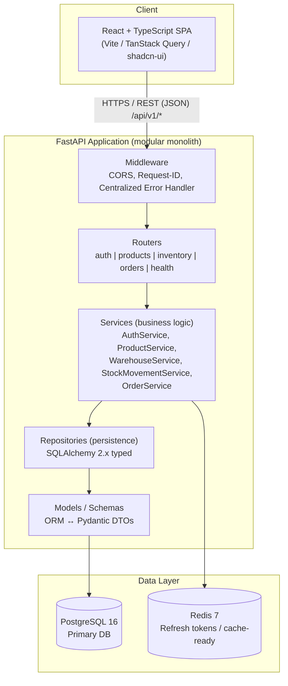
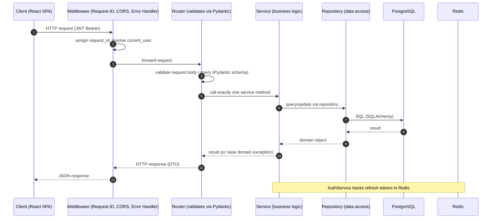
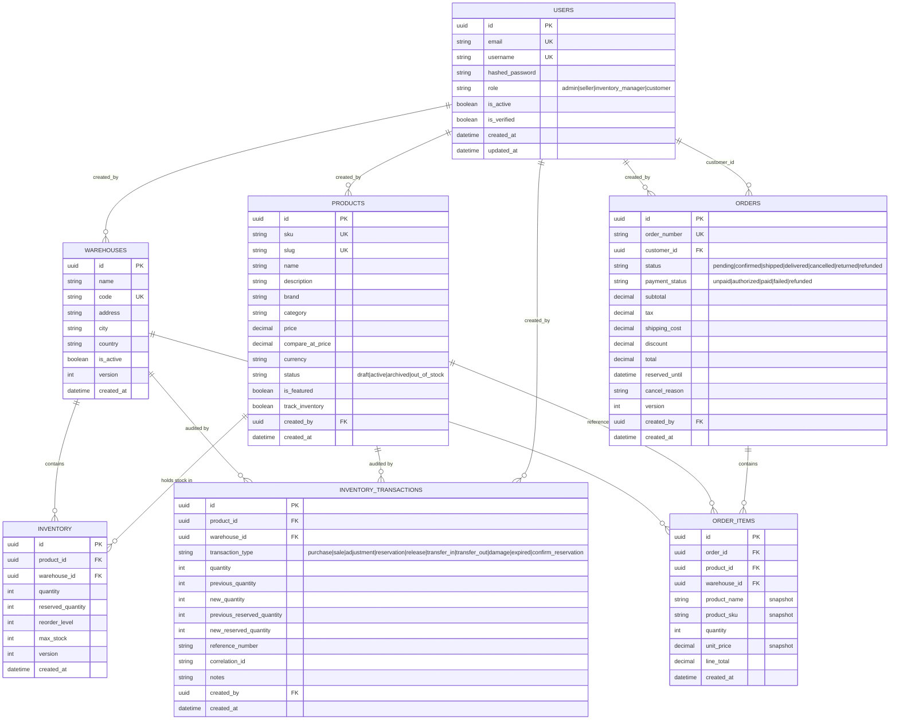
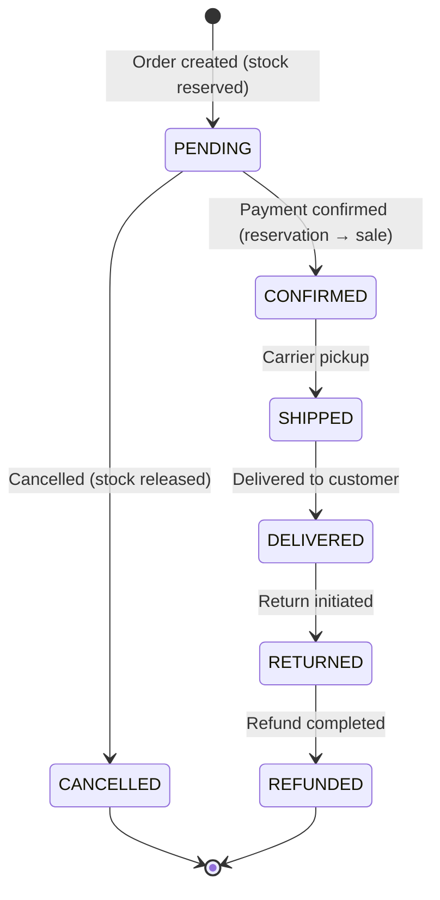
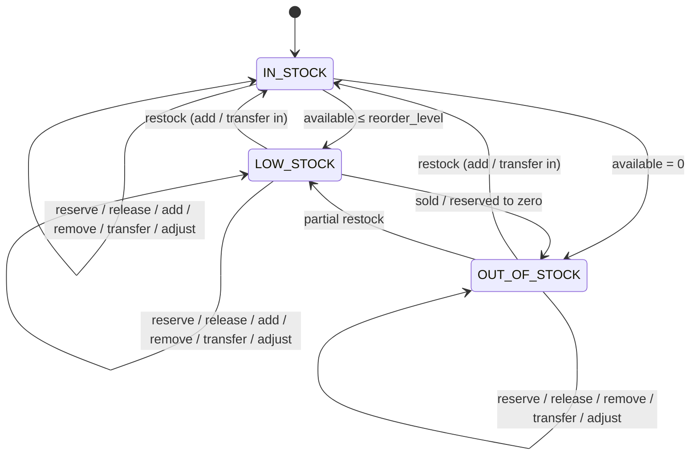

# CommerceOS — Diagrams

This document contains the key architecture and lifecycle diagrams for
CommerceOS, rendered with **Mermaid** (renders on GitHub, GitLab, and VS Code
with the Mermaid extension, or at [mermaid.live](https://mermaid.live/)).

All diagrams reflect the **currently implemented** system. For context on
what is implemented vs. planned, see
[CommerceOS_Architecture.md](../CommerceOS_Architecture.md).

---

## Table of Contents

1. [High-Level Architecture](#1-high-level-architecture)
2. [Backend Request Flow](#2-backend-request-flow)
3. [Database ER Diagram](#3-database-er-diagram)
4. [Order Lifecycle](#4-order-lifecycle)
5. [Inventory Lifecycle](#5-inventory-lifecycle)

---

## 1. High-Level Architecture

**Key point:** CommerceOS is a **modular monolith**. Each module owns its own
router, service, and repository; cross-module calls go through **service
interfaces** (e.g., `OrderService` → `StockMovementService`), never through
direct model imports across modules. This is the seam that allows future
decomposition into microservices.

---

## 2. Backend Request Flow

The strict, one-directional dependency chain enforced throughout the codebase:

**Layering rules** (enforced by convention):

- **Routers** know nothing about SQLAlchemy — they only parse/validate HTTP.
- **Services** know nothing about HTTP — no `Request`/`Response` leak in.
- **Repositories** know no business rules — they only persist.
- Business/validation errors are raised as domain exceptions and mapped to
  HTTP by the **centralized error handler** into a consistent envelope.

---

## 3. Database ER Diagram

**Key invariants:**

- `INVENTORY` is the **single source of truth** for stock, with a unique
  `(product_id, warehouse_id)` pair.
- `INVENTORY_TRANSACTIONS` is an **immutable append-only audit ledger** — every
  stock change writes a record.
- `ORDER_ITEMS` **snapshots** product name / SKU / unit price at order time so
  history is immutable.
- All IDs are **UUIDs** (no enumerable public IDs); money is stored as
  fixed-point `Numeric`.

---

## 4. Order Lifecycle

**Transition map** (enforced in `OrderService` via `ORDER_STATUS_TRANSITIONS`):

| From | Allowed To |
|------|-----------|
| `pending` | `confirmed`, `cancelled` |
| `confirmed` | `shipped` |
| `shipped` | `delivered` |
| `delivered` | `returned` |
| `returned` | `refunded` |
| `cancelled` | _(terminal)_ |
| `refunded` | _(terminal)_ |

**Inventory integration throughout:**

- **Create** → `reserve_stock` (stock reserved for the pending order).
- **Confirm payment** → `confirm_reservation` (reservation converted to a sale,
  physical stock deducted).
- **Cancel / delete** → `release_reservation` (reserved stock released).
- **Item qty change** → reserve or release the difference.

---

## 5. Inventory Lifecycle

**Stock movement model** — every transition above is driven by one of these
operations, each of which writes an immutable `InventoryTransaction`:

| Operation | Effect on `quantity` | Effect on `reserved_quantity` | Transaction type |
|-----------|----------------------|-------------------------------|------------------|
| **Add** | + | — | `purchase` / `return` |
| **Remove** | − | — | `damage` / `expired` / `adjustment` |
| **Adjust** | set to target | — | `adjustment` |
| **Reserve** | — | + | `reservation` |
| **Release** | — | − | `release` |
| **Confirm** | − | − | `confirm_reservation` + `sale` |
| **Transfer** | src − / dest + | — | `transfer_out` + `transfer_in` (shared `correlation_id`) |

**Concurrency & correctness:**

- All reads-for-modification use `SELECT ... FOR UPDATE` to prevent overselling.
- Optimistic concurrency (`version` field) is a second safety layer.
- DB `CHECK` constraints guarantee `quantity >= 0`, `reserved <= quantity`,
  and non-negative monetary fields.
- `available_quantity` is a **computed** property (`quantity − reserved`),
  never stored, so it cannot drift out of sync.

---

_See [CommerceOS_Architecture.md](../CommerceOS_Architecture.md) for the full
reference architecture and roadmapped future modules._
